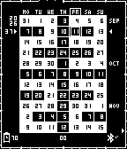
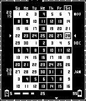
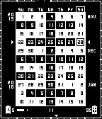

# Pebble 11 Weeks Watchface

A beautiful calendar watchface for Pebble showing the current week of the year with customizable display options and live preview.

## 🎯 About

This is a repackaged version of the excellent **11 Weeks Watchface** originally created by **[programus@gmail.com](https://github.com/programus/pebble-watchface-11weeks)**.

**Full credit goes to the original author** for creating this beautiful watchface.

## 💾 Installation

### Option 1: Rebble App Store (Recommended)

**🏪 [Install from Rebble App Store](https://apps.rebble.io/en_US/application/6903d9978e00390009cf73d9)**

The store listing may still contain the previous version. For the calendar fix in v2.9, use the direct download below.

### Option 2: Direct Download

**📦 [Download 11weeks-watchface-v2.9.pbw](releases/11weeks-watchface-v2.9.pbw)** (Latest - v2.9)

[SHA-256 checksum](releases/11weeks-watchface-v2.9.sha256) · Builds for aplite, basalt and diorite. Open the PBW on your phone with the Pebble app to update the existing watchface.

Or download from [GitHub Releases](https://github.com/TensorChris/pebble-11weeks-config/releases)

**Features:**
- ✅ Settings work perfectly
- ✅ Full Pebble 2 support
- ✅ All platforms: Pebble, Pebble Steel, Pebble Time series, Pebble 2

### Screenshots

Calendar correction in v2.9: Friday, 11 September 2026, at 23:22. Actual aplite emulator capture with the existing date outline.

### Installation Steps

1. Install from Rebble App Store **OR** download the `.pbw` file and transfer it to your phone
2. Open with the Pebble app - it will be installed automatically
3. Open the watchface settings in the Pebble app
4. Configure your preferred options with live preview!

## ⚙️ Configuration Options

The page offers the following customizable settings:

- **Seconds**: Display seconds (increases battery usage)
- **Outline Frame**: Animated frame border (increases battery usage)
- **Pebble Battery**: Show watch battery level (now displays two digits: 15, 42, 73)
- **Phone Battery & Bluetooth**: Show phone battery and Bluetooth status
- **Week starts on Monday**: Start the week on Monday instead of Sunday
- **Quiet Time Indicator**: Show moon icon when Quiet Time is active
- **Week Number (CW)**: Display ISO 8601 calendar week number next to current week indicator

**Note:** Disabling the outline frame and seconds reduces battery consumption as the watchface will update once per minute instead of once per second.

## ✨ Features

- ✅ **Embedded Configuration**: No cloud dependency - config page is embedded directly in the watchface
- ✅ **Persistent Settings**: Your configuration is saved and loads correctly each time
- ✅ **Works Offline**: All functionality works without internet connection

## 📜 Version History

**v2.9** (Current)
- Fixes dates appearing in the previous weekday column late in the evening.
- Uses local Gregorian calendar days independently of timezone normalization and daylight saving changes.
- Preserves the existing pixel artwork, date outline, configuration and watchface identity.
- Verified with frozen regression tests and real SDK emulator runs on aplite, basalt and diorite.

**v2.8.1** (Previous)
- **Week Number (CW) Display** - shows ISO 8601 calendar week number
- Displays to the left of the current week arrow indicator
- Configurable via settings toggle
- Safe implementation that preserves calendar integrity
- **Tighter weekday headers** - reduced letter spacing for cleaner look

**v2.7** (Previous)
- **Quiet Time Indicator** - shows moon icon when Quiet Time is active
- Icon appears above watch battery when Do Not Disturb is enabled
- Configurable via settings toggle
- Polls Quiet Time status every minute

**v2.6** (Previous)
- **Embedded configuration page** - no cloud dependency!
- Config page embedded as Data-URI directly in JavaScript
- Works completely offline
- Simplified, clean settings interface
- All settings fully functional
- Improved reliability and faster loading

**v2.4** (Previous)
- **Week starts on Monday** option with instant updates
- **Two-digit battery display** (15, 42, 73 instead of 1, 4, 7)
- Dynamic weekday headers that adapt to week start preference
- Improved config persistence across restarts

**v2.2**
- **Recompiled from source** using Pebble SDK with new UUID
- **Settings work perfectly!** Phone and watch communicate correctly
- New UUID: `8ae4dd92-b5fa-42fa-aca9-d326dfad417f`
- Full Pebble 2 (Diorite) support with proper binaries

**v2.0** (Original)
- Created by programus@gmail.com
- Original hosting no longer available

## 🙏 Credits

- **Original Watchface & Config Page**: [programus@gmail.com](https://github.com/programus/pebble-watchface-11weeks)
- **Repackaging & GitHub Pages Hosting**: TensorChris

This project exists solely to keep this wonderful watchface usable. All credit for the design and original implementation goes to the original author.

## 📄 License

This project respects the license of the original 11 Weeks Watchface project. Please refer to the [original repository](https://github.com/programus/pebble-watchface-11weeks) for license information.

## 🔗 Links

- **Rebble App Store**: https://apps.rebble.io/en_US/application/6903d9978e00390009cf73d9
- **Original Project**: https://github.com/programus/pebble-watchface-11weeks
