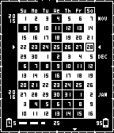

# Pebble 11 Weeks Watchface

A beautiful calendar watchface for Pebble showing the current week of the year with customizable display options and live preview.

## 🎯 About

This is a repackaged version of the excellent **11 Weeks Watchface** originally created by **[programus@gmail.com](https://github.com/programus/pebble-watchface-11weeks)**.

**Full credit goes to the original author** for creating this beautiful watchface.

## 💾 Installation

### Option 1: Rebble App Store (Recommended)

**🏪 [Install from Rebble App Store](https://apps.rebble.io/en_US/application/6903d9978e00390009cf73d9)**

The easiest way to install and keep the watchface updated.

### Option 2: Direct Download

**📦 [Download 11weeks-watchface-v2.4.pbw](releases/11weeks-watchface-v2.4.pbw)** (Latest - v2.4)

Or download from [GitHub Releases](https://github.com/TensorChris/pebble-11weeks-config/releases)

**Features:**
- ✅ Settings work perfectly
- ✅ Full Pebble 2 support
- ✅ All platforms: Pebble, Pebble Steel, Pebble Time series, Pebble 2

### Screenshots

### Installation Steps

1. Install from Rebble App Store **OR** download the `.pbw` file and transfer it to your phone
2. Open with the Pebble app - it will be installed automatically
3. Open the watchface settings in the Pebble app
4. Configure your preferred options with live preview!

## ⚙️ Configuration Options

The page offers the following customizable settings:

- **Seconds**: Display seconds (increases battery usage)
- **Outline Frame**: Animated frame border (increases battery usage)
- **Pebble Battery**: Show watch battery level (now displays two digits: 05, 42, 73)
- **Phone Battery & Bluetooth**: Show phone battery and Bluetooth status
- **Week starts on Monday**: Start the week on Monday instead of Sunday

**Note:** Disabling the outline frame and seconds reduces battery consumption as the watchface will update once per minute instead of once per second.

## ✨ Features

- ✅ **Live Preview**: See your changes in real-time with a canvas-based watchface preview
- ✅ **Persistent Settings**: Your configuration is saved and loads correctly each time
- ✅ **Multi-language Support**: Auto-detects your browser language
  - English (en)
  - Simplified Chinese (zh-Hans)
  - Traditional Chinese (zh-Hant)
  - Japanese (ja)

## 📜 Version History

**v2.4** (Current - NEW FEATURES! ✨)
- **Week starts on Monday** option with instant updates
- **Two-digit battery display** (05, 42, 73 instead of 5, 42, 73)
- Dynamic weekday headers that adapt to week start preference
- Improved config persistence across restarts
- Instant visual updates when changing settings

**v2.2** (RECOMPILED! ✅)
- **Recompiled from source** using Pebble SDK with new UUID
- **Settings work perfectly!** Phone and watch communicate correctly
- New UUID: `8ae4dd92-b5fa-42fa-aca9-d326dfad417f`
- Ready for Rebble Store submission
- Full Pebble 2 (Diorite) support with proper binaries
- CompanyName: TensorChris
- LongName: 11 Weeks Calendar
- Config page: https://tensorchris.github.io/pebble-11weeks-config/config.html
- Recommended for both personal use and Rebble Store

**v2.1.8-personal**
- Working version but uses original UUID
- Not suitable for Rebble Store
- For personal sideloading only

**v2.1.7**
- Attempted to use new UUID with old binaries
- Settings timeout issue - not recommended

**v2.1.6**
- Attempted revert to original JavaScript
- Settings still not working - not recommended

**v2.1.5**
- Attempted fix with modified JavaScript (caused issues)
- Not recommended - use v2.1.6 instead

**v2.1.4**
- Added proper Pebble 2 (Diorite) support with complete platform binaries
- Fixes Rebble App Store compatibility issue where Pebble 2 was shown as unsupported
- Had timeout issue when opening settings (fixed in v2.1.5)

**v2.1.3**
- Fixed sideloading error from v2.1.2
- Removed Diorite target but broke Rebble Store compatibility for Pebble 2
- Not recommended - use v2.1.4 instead

**v2.1.2** (Broken - Do Not Use)
- Had sideloading error due to missing Diorite binaries

**v2.1.1**
- Added complete original description from programus@gmail.com
- Included watchface screenshots in Pebble app
- Proper credits in app description

**v2.1**
- Settings now persist correctly when reopening configuration
- Live canvas-based watchface preview enabled
- Multi-language support maintained
- Configuration page hosted on GitHub Pages

**v2.0** (Original)
- Created by programus@gmail.com
- Original hosting no longer available

## 🙏 Credits

- **Original Watchface & Config Page**: [programus@gmail.com](https://github.com/programus/pebble-watchface-11weeks)
- **Repackaging & GitHub Pages Hosting**: TensorChris

This project exists solely to keep this wonderful watchface usable. All credit for the design and original implementation goes to the original author.

## 📄 License

This project respects the license of the original 11 Weeks Watchface project. Please refer to the [original repository](https://github.com/programus/pebble-watchface-11weeks) for license information.

## 🔗 Links

- **Rebble App Store**: https://apps.rebble.io/en_US/application/6903d9978e00390009cf73d9
- **Original Project**: https://github.com/programus/pebble-watchface-11weeks
