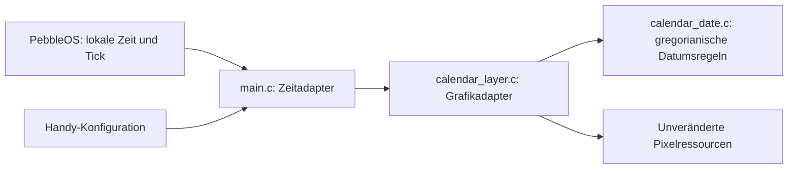

# Kalenderkorrektur: Architektur

Diese Beschreibung erläutert die Implementierung. Die einzige fachliche
Referenz bleibt der freigegebene Vertrag `contracts/calendar-weekday-v1.html`
mit SHA-256 `3765d401a3861c90a4dce1d5f94c5ce27764bf9e140deaa9e8a2a25ae19c2e8e`.

## C4: Kontext und Container

Christian verwendet das native Watchface auf der Pebble. PebbleOS liefert lokale
Zeit und Minutenereignisse; die vorhandene Handy-JavaScript-Komponente überträgt
und speichert die Anzeigeeinstellungen. Die PBW enthält dieselbe Anwendung für
aplite, basalt und diorite. Es gibt keinen zusätzlichen Dienst oder Datenspeicher.

## C4: Komponenten

`CalendarDate` bildet ein gültiges lokales Datum mit Jahr, Monat, Tag und
Wochentag ab. Der Grafikadapter übersetzt einmal die vorhandenen lokalen
`struct tm`-Felder. Das Datumsmodul arbeitet anschließend ausschließlich mit
diesen Werten und hängt nur von der C-Standarddefinition für `bool` ab.
Es kennt weder Pebble-Grafik noch Zeitzonen, Konfiguration, Systemzeit oder
Speicherzugriffe. Die Abhängigkeit zeigt vom Grafikadapter zur Datumslogik;
eine zusätzliche Service- oder Persistenzabstraktion ist dafür nicht nötig.

Der Kalenderstart wird durch Zurückgehen um sieben Kalendertage, zum
Monatsersten und zum gewählten Wochenbeginn bestimmt. Die Fortschaltung
berücksichtigt Monatslängen sowie die gregorianische Schaltjahrregel. Der
Renderer verwendet eine lokale Kopie; der aktuelle Zeitwert bleibt unverändert.

Die alte Berechnung setzte `tm_gmtoff` auf null und normalisierte danach mit
`mktime`. Neuere Firmware normalisiert wieder auf lokale Zeit; spät am Abend
konnte dadurch bereits der nächste Tag in der vorherigen Spalte stehen.
Die neue Berechnung benötigt diese Normalisierung und feste 24-Stunden-Abstände
nicht mehr. Darstellung, Heute-Rahmen, Konfigurationsformat, UUID, Grafikdateien
und bestehende Kalenderwochenanzeige bleiben erhalten.

## Nachweise

Die eingefrorenen Tests stehen in `../tests/`, ihre Zuordnung zum Vertrag in
`../tests/TRACEABILITY.md`. Der Host prüft beide belegten Firmware-Zeitmodelle
und die tatsächlichen Pixel; die Pipeline baut und installiert alle drei
Plattformen und prüft Konfiguration, Neustart und natürliche Mitternachtswechsel.
Die SDK-Grenze für Quiet Time und der ergänzende Test der echten Hauptfunktionen
stehen ausdrücklich in `../tests/README.md`.
